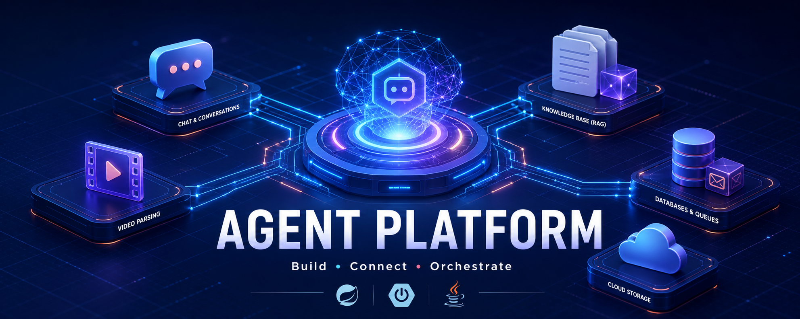
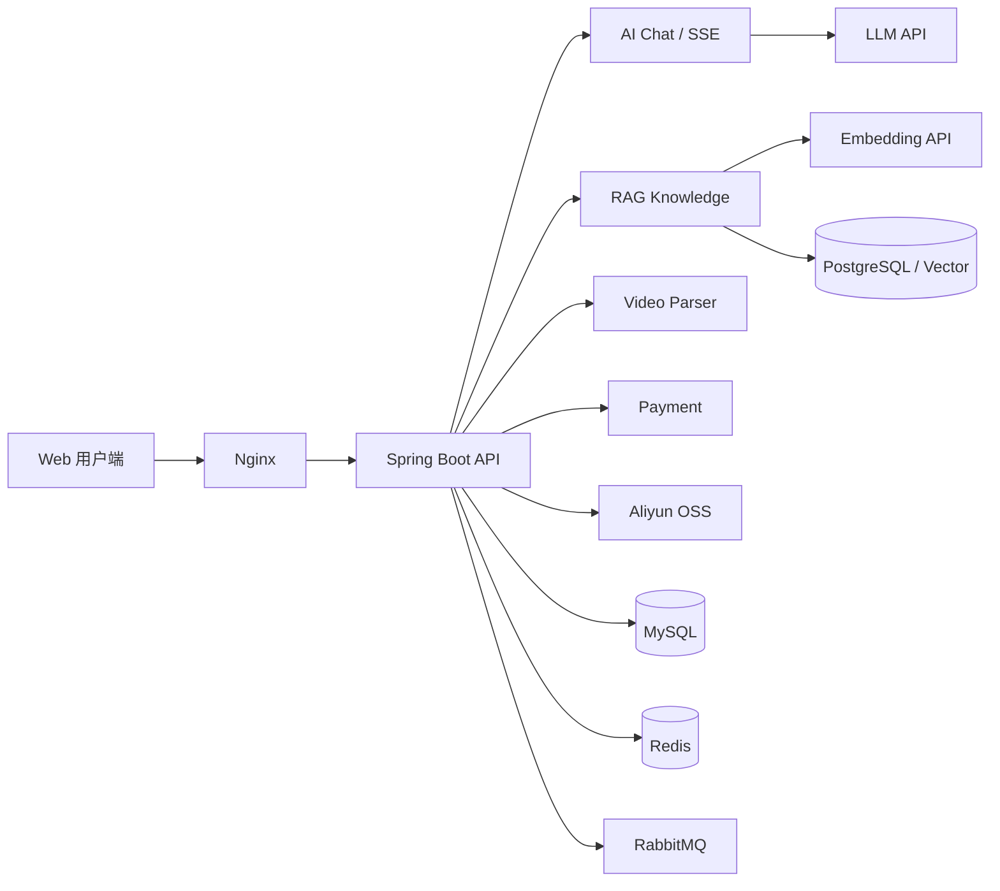

<p align="center">
  
</p>

<h1 align="center">Agent Platform</h1>

<p align="center">
  基于 Spring Boot 的 AI Agent 应用平台，整合流式对话、RAG 知识库、文档解析、视频解析、会员支付与对象存储。
</p>

<p align="center">
  
  
  
  
  
  
  
  
</p>

## 项目亮点

| 模块 | 能力 |
| --- | --- |
| AI 对话 | 普通响应与 SSE 流式输出、会话管理、历史消息 |
| RAG 知识库 | 文档上传、切片、向量化、语义检索、上下文增强 |
| 文档解析 | PDF、Word、Excel、HTML 等格式解析 |
| 视频工具 | 视频链接解析、JSON 响应与资源代理 |
| 用户系统 | 注册、登录、验证码、JWT 鉴权、个人信息 |
| 会员支付 | 支付宝二维码支付、订单状态与会员校验 |
| 文件存储 | 阿里云 OSS 图片、视频和通用文件上传 |
| 基础设施 | MySQL、PostgreSQL、Redis、RabbitMQ、Nginx、Docker Compose |

## 系统架构



## 页面入口

启动服务后可访问：

- 登录注册：`http://localhost:8080/index.html`
- 平台首页：`http://localhost:8080/home.html`
- AI 对话：`http://localhost:8080/chat.html`
- 知识库：`http://localhost:8080/knowledge.html`
- 视频解析：`http://localhost:8080/video.html`
- 会员支付：`http://localhost:8080/member-pay.html`

## 技术栈

- 后端：Java 17、Spring Boot 3.2.5、MyBatis-Plus、JJWT
- AI/RAG：兼容 OpenAI 风格的对话与 Embedding API
- 文档：Apache Tika、PDFBox、Apache POI、jsoup
- 数据：MySQL、PostgreSQL、Redis
- 消息：RabbitMQ
- 存储：Aliyun OSS
- 部署：Docker、Docker Compose、Nginx

## 快速开始

### 1. 准备环境

- JDK 17+
- MySQL 8+
- PostgreSQL（知识库向量数据）
- Redis
- RabbitMQ

### 2. 创建配置

复制示例配置：

```powershell
Copy-Item src/main/resources/application.example.yml src/main/resources/application.yml
```

`application.yml` 已被 Git 忽略，真实密钥不会进入仓库。

建议至少配置以下环境变量：

```text
MYSQL_PASSWORD
POSTGRES_PASSWORD
REDIS_PASSWORD
RABBITMQ_PASSWORD
JWT_SECRET
DEEPSEEK_API_KEY
EMBEDDING_API_URL
ALIYUN_OSS_ACCESS_KEY_ID
ALIYUN_OSS_ACCESS_KEY_SECRET
ALIYUN_OSS_BUCKET_NAME
```

支付宝功能还需要：

```text
ALIPAY_APP_ID
ALIPAY_PRIVATE_KEY
ALIPAY_PUBLIC_KEY
```

### 3. 初始化数据库

执行：

```text
src/main/resources/sql/chat_message.sql
src/main/resources/sql/rag_knowledge.sql
```

### 4. 启动项目

```powershell
.\mvnw.cmd spring-boot:run
```

## Docker

先构建应用：

```powershell
.\mvnw.cmd clean package
Copy-Item target\demo-0.0.1-SNAPSHOT.jar app.jar
docker compose up -d --build
```

生产环境请通过 `.env` 或部署平台注入密码和密钥，不要使用示例默认值。

## OSS 配置

平台已内置阿里云 OSS 支持。配置以下变量即可使用，无需把 AccessKey 写入代码：

```text
ALIYUN_OSS_ENDPOINT
ALIYUN_OSS_ACCESS_KEY_ID
ALIYUN_OSS_ACCESS_KEY_SECRET
ALIYUN_OSS_BUCKET_NAME
```

README 横幅存放在仓库的 `docs/assets` 中，确保 GitHub 可稳定加载；业务图片、视频和大文件适合交给 OSS。

## 当前状态

项目正在迭代中。当前 `mvn test` 会在 `ChatController` 编译阶段失败，原因是控制器调用参数与 `ChatMessageService`、`DeepSeekService` 的最新接口签名尚未同步。该问题不影响仓库结构展示，但需要修复后才能完整构建运行。

## 安全说明

- 不要提交 `application.yml`、`.env` 或任何真实密钥。
- 已泄露过的支付宝、JWT 或云服务密钥应立即在对应平台轮换。
- 部署前必须替换所有 `change-me` 示例值。

---

<p align="center">
  Built with Java, Spring Boot and a practical AI application stack.
</p>
